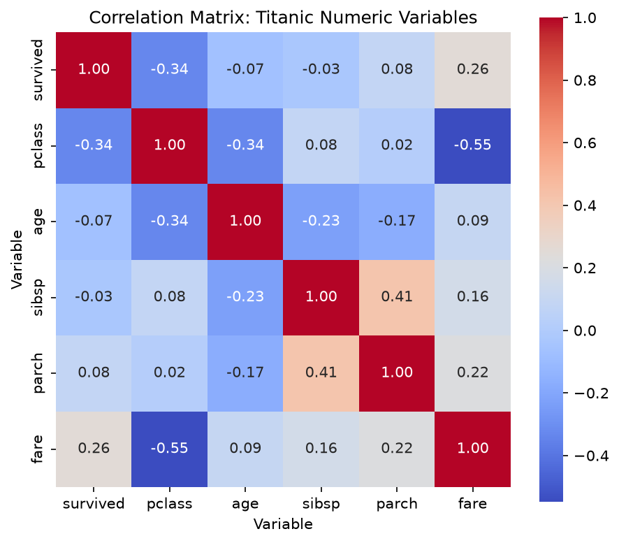
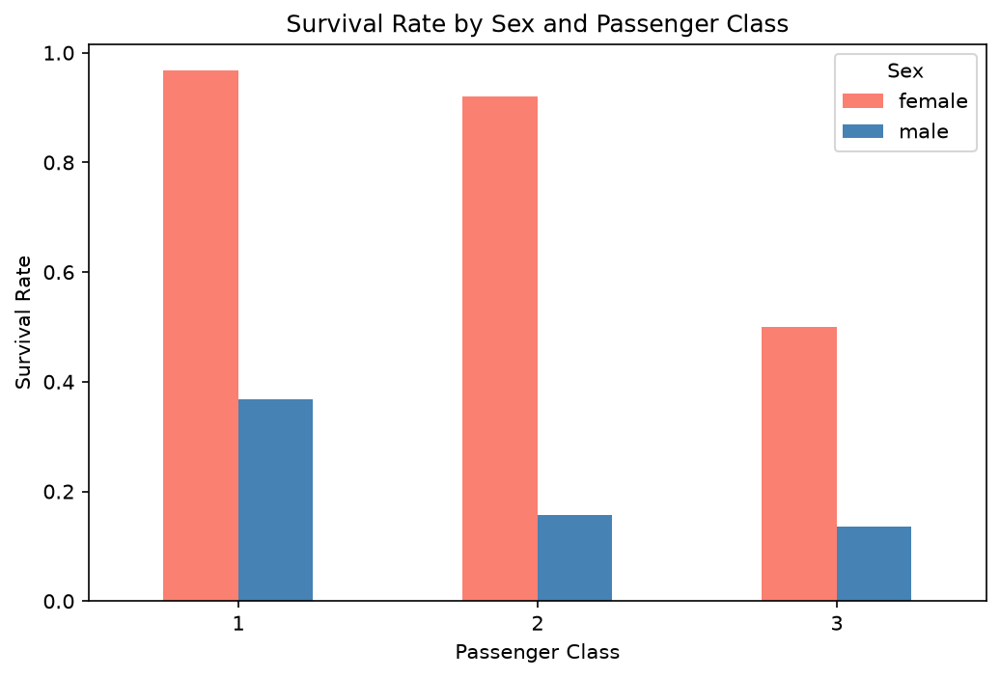
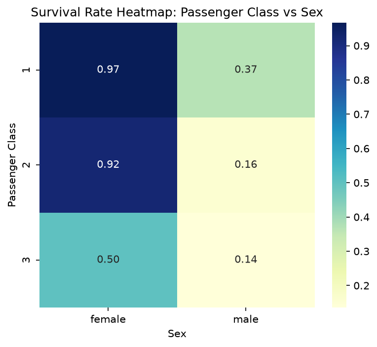
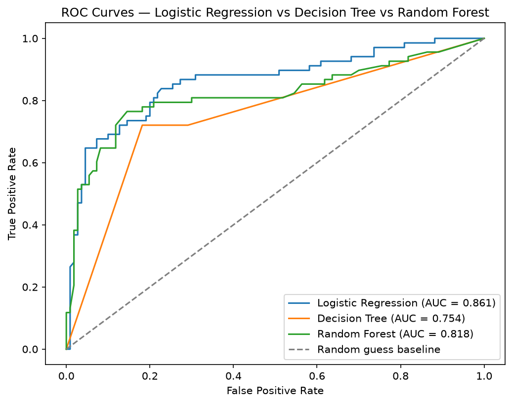

# Module 2 — Titanic Dataset Analysis and Machine Learning

## Overview

This module profiles, cleans, and analyzes the Titanic dataset (`01_eda.ipynb`), then builds and evaluates a full classification pipeline plus a regression side-task (`02_modeling.ipynb`). All results below are drawn directly from the completed and verified notebook runs.

## Dataset and Data Preparation

- Titanic dataset loaded once via `sns.load_dataset('titanic')`, immediately saved as `titanic.csv` (the committed offline fallback).
- Raw dataset: `(891, 15)`
- Missing-value handling, applied per the percentage-based threshold rule:

| Column | Missing % | Threshold | Decision | Justification |
|---|---|---|---|---|
| `age` | 19.87% | 5%–30% → Impute | Median imputation | Numeric variable with moderate skew; median is more robust than mean |
| `embarked` | 0.22% | <5% → Drop rows | Drop affected rows | Only 2 rows affected, negligible impact |
| `deck` | 77.22% | Very high → explicit choice | Encode as `"Unknown"` | Retains potentially informative missingness rather than discarding the column |
| `embark_town` | 0.22% | <5% → Drop rows | Drop affected rows | Only 2 rows affected, negligible impact |

- Cleaned dataset: `(889, 15)`, `0` remaining missing values.
- Stratified train/test split (before preprocessing): training set `(711, 14)` before feature selection, test set `(178, 14)`.
- Training survival rate: `0.3826`; test survival rate: `0.3820`; full cleaned dataset survival rate: `0.3825` — confirming the stratified split preserved the original class balance.

## Exploratory Data Analysis

**Fare skew:** mean (32.0967) > median (14.4542) > mode (8.05) — this ordering indicates a **right-skewed distribution**, driven by a small number of very high-fare passengers pulling the mean well above the median. IQR-based outliers: `65` in `age`, `114` in `fare`.

**Correlation analysis** (6×6 matrix on `survived, pclass, age, sibsp, parch, fare`), top 2 strongest pairs:
1. **`pclass` and `fare` (r = -0.55)** — as passenger class number increases (1st→3rd), fare decreases sharply, since `pclass` is essentially a coded proxy for ticket price tier.
2. **`sibsp` and `parch` (r = 0.41)** — passengers travelling with more siblings/spouses also tend to travel with more parents/children, suggesting family groups tended to travel together as a unit.



**Multivariate data story** (4 charts):
1. *Survival rate by sex and class:* female survival rate is dramatically higher than male at every class, but the gap narrows in 3rd class — 1st class ~97% female vs 37% male, 2nd class ~92% vs 16%, 3rd class ~50% vs 14%.
2. *Age distribution by survival status:* both groups show a very similar median age (~28); age alone did not strongly separate survivors from non-survivors.
3. *Fare vs age, colored by survival:* survivors are visibly denser at higher fares (above ~£100); age showed no clear separating pattern.
4. *Survival rate heatmap, class × sex:* numerically confirms chart 1 — highest rate is 1st class female (0.97), lowest is 3rd class male (0.14).



## Modeling Approach

Preprocessing (median imputation + scaling for numeric features; most-frequent imputation + one-hot encoding for categorical features) was fit only on the training set via a `ColumnTransformer`, then applied to the test set — no leakage. Three classifiers were trained on identical training data: Logistic Regression, Decision Tree, Random Forest.

## Model Evaluation

Test-set results for all three classifiers:

| Model | Accuracy | Precision | Recall | F1-Score | ROC-AUC |
|---|---:|---:|---:|---:|---:|
| Logistic Regression | 0.808989 | 0.783333 | 0.691176 | 0.734375 | 0.860963 |
| Decision Tree | 0.769663 | 0.690141 | 0.720588 | 0.705036 | 0.754144 |
| Random Forest | 0.820225 | 0.781250 | 0.735294 | 0.757576 | 0.817914 |



## Imbalance Handling

Training set class balance: `439 (61.74%)` did not survive, `272 (38.26%)` survived.

| Strategy | Precision | Recall | F1-Score |
|---|---:|---:|---:|
| Baseline | 0.781250 | 0.735294 | 0.757576 |
| `class_weight='balanced'` | 0.739130 | 0.750000 | 0.744526 |
| SMOTE | 0.746032 | 0.691176 | 0.717557 |

**Conclusion:** Baseline achieved the highest F1-score and highest precision. `class_weight='balanced'` achieved the highest recall. SMOTE performed worst overall on these three metrics, despite perfectly balancing the training classes. The baseline provided the strongest precision/recall/F1 balance for this dataset and model; class weighting may be preferable when recall is specifically prioritized. SMOTE did not appear beneficial for this particular dataset/model combination.

## Hyperparameter Tuning

GridSearchCV over Random Forest's `n_estimators`, `max_depth`, `max_features` (5-fold CV; fold count and scoring metric not specified by the requirements, so standard `GridSearchCV` defaults were used), performed on training data only:

- Best parameter combination: `{'max_depth': 5, 'max_features': 'sqrt', 'n_estimators': 300}`
- Best cross-validation score: `0.8200`
- Out-of-bag (OOB) score: `0.8214` (a training-side estimate, not a held-out test-set score)

## Regression Side-Task

Predicting `fare` from the other available features via multivariate linear regression:

| Metric | Value |
|---|---:|
| MAE | 19.753109 |
| RMSE | 41.270050 |
| R² | 0.347148 |
| Adjusted R² | 0.308055 |

**Heteroscedasticity assessment:** the residual plot showed clear heteroscedasticity. Residuals were tightly clustered around zero for lower predicted fares, while their spread increased substantially at higher predicted fares, including a large positive outlier. This indicates a non-constant residual spread rather than a random, uniform distribution.

## Final Model Comparison

**Classification** (see Model Evaluation table above).

**Regression:**

| Model | MAE | RMSE | R² | Adjusted R² |
|---|---:|---:|---:|---:|
| Linear Regression (predicting fare) | 19.753109 | 41.270050 | 0.347148 | 0.308055 |

*(Classification and regression metrics are presented as separate groups — they are on different scales and not directly comparable.)*

## Final Recommendation

Random Forest is the recommended classifier for deployment. It achieves the highest accuracy (0.8202), highest F1-score (0.7576), and highest recall (0.7353) among the three models, indicating the best overall balance between correctly identifying survivors and avoiding false predictions. Logistic Regression achieves the highest ROC-AUC (0.8610 vs. 0.8179) and slightly higher precision, meaning it ranks cases marginally more reliably across all possible thresholds — a real trade-off worth noting rather than a reason to dismiss it outright. Decision Tree shows the weakest performance across the main metrics and is not recommended. On balance, Random Forest's stronger performance at the actual decision threshold makes it the preferred choice for a system that needs to output a firm survived/did-not-survive prediction.

## Saved Model Pipeline

`analytics/model_pipeline.joblib` — a combined scikit-learn `Pipeline` containing the fitted `ColumnTransformer` preprocessing steps together with the original Task 10 Random Forest classifier, saved via `joblib.dump`. Reloaded successfully with `joblib.load()` and confirmed to predict correctly on raw, unprocessed input:

```
Reloaded pipeline prediction: [0]
Original pipeline prediction: [0]
Predictions match: True
```

## Files in this module

| File | Purpose |
|---|---|
| `01_eda.ipynb` | Load, profile, clean, and explore the Titanic dataset |
| `titanic.csv` | Raw dataset, saved immediately after loading (offline fallback) |
| `02_modeling.ipynb` | Reproduces cleaning, splits, preprocesses, trains/evaluates/tunes models, regression side-task, saves pipeline |
| `model_pipeline.joblib` | Saved, reloadable end-to-end prediction pipeline |
| `README.md` | This file |